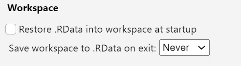
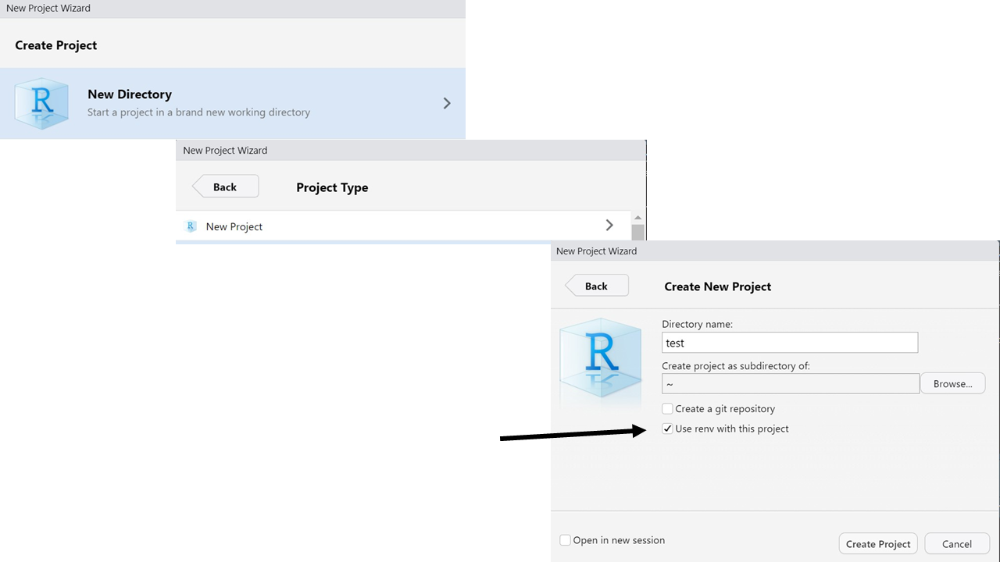
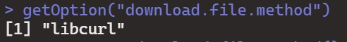
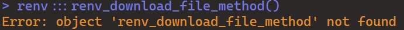
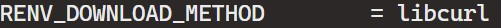
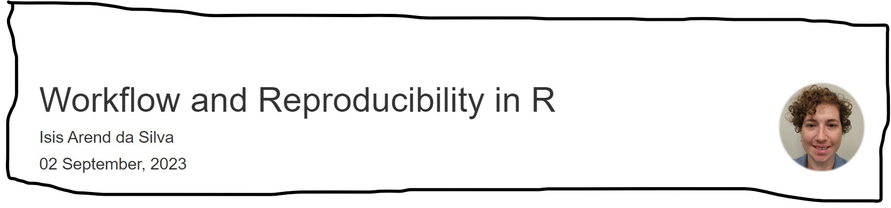

Workflow and Reproducibility in R </a>
================
Isis Arend da Silva
03 September, 2023

# Description

Projects grow and tend to include an increasing number of collaborators.
As a consequence, folder’s structure tend to get more complex. Open
science is expanding!!! Yeah!!! And, most of us are required to upload
the raw data and a reproducible code alongside our papers. So, look up
to the future and improve workflow and reproducibility. <br> <br> I
produced this document as I tried to implement changes into my own
.Rprojects. <br> <br> Importantly, this document is divided into two
main sessions: Workflow and Reproducibility. This is not a clear cut.
<br> <br> Within “Workflow” I included the changes that should improve
workflow on a daily basis for you and between you and your
collaborators. <br> <br> Within “Reproducibility” I included changes
that are more difficult to implement, specially for ongoing projects,
not all your collaborators will want to implement that at the developing
stage. But, I think it should be done at the publication stage of your
codes.

# Workflow

## Starting your code with `rm(list =ls())` does not do what you think

- R scrips assume that you are starting from a fresh environment. And
  guess what? `rm(list = ls())`

does not refresh your R environment.

- `rm(list = ls())` does not detach packages. We know that many packages
  overwrite functions of others. Also, you might be calling functions
  from a package which you did not `library()`. Thus, your code might
  not run in your collaborator’s environment as smooth as think it
  would.

- Anything set to non-default values remain that way. Example: That plot
  that you did two days ago in other script using `par(mfrow=c(6,3))`.

## How to start with a fresh R environment?

- Do not save `.RData` when you quit R, and do not load `.RData` when
  you open R.

- To implement that, go to global options general and change this
  configuration:



## More to improve workflow

- Often refresh your R using `.rs.restartR()` and run your code from the
  top. I found . `.rs.restartR()` specially useful for plotting, when
  you get that warning “cannot open because is already open somewhere
  else” What I used to do before finding out that this perfectly solve a
  problem I face daily? I used to quit R and run all my script again.
  Shame on me hehehe. We all need to start somewhere.
- For objects that take too long to generate use `saveRDS()` and
  `readRDS()`

Based on
[workflow-vs-script](https://www.tidyverse.org/blog/2017/12/workflow-vs-script/)

## Improve your relative paths with `here()` package

- `.Rprojects` are just part of the solution. Thus, if you already use
  `.Rprojects`, good job! If you do not use `.Rprojects`, START NOW;

- You probably did not realize that Rstudio is not the only environment
  that integrates R (vim + Nvim-R, Visual Studio + RTVS, Shell), or that
  your operating system is not the only one as well. Yes, I have not
  thought this far either.

- Relative paths `"data/dogs.csv"` are not the same across environments
  and operating systems. `here()` fix this problem, and paths can read
  across environments and operating systems.

``` r
library(here)
```

    ## here() starts at C:/Users/Isis/Documents/Data_Projects/Workflow_reproducibility_R.1

``` r
#when you call here(), it will find YOUR paths.
here()
```

    ## [1] "C:/Users/Isis/Documents/Data_Projects/Workflow_reproducibility_R.1"

- `here()` finds your `.Rproject` and set up you working directory to
  the top level. It is relevant in two cases:

- When you juggle with .R and .Rmd scripts and do not want to have a
  supper messy folder, it is common to store these scripts in separate
  folders. .Rmd scripts set as the working directory the folder they are
  in. Thus, if you have a folder only for .Rmd files your relative paths
  will not work.

- Second, when using `here()` if you open only the script in other
  instance of your Rstudio, your paths still work, because `here()`
  always find the original `here()`.

### Some examples on how to use `here()`

``` r
library(tidyverse)
head(iris)
```

    ##   Sepal.Length Sepal.Width Petal.Length Petal.Width Species
    ## 1          5.1         3.5          1.4         0.2  setosa
    ## 2          4.9         3.0          1.4         0.2  setosa
    ## 3          4.7         3.2          1.3         0.2  setosa
    ## 4          4.6         3.1          1.5         0.2  setosa
    ## 5          5.0         3.6          1.4         0.2  setosa
    ## 6          5.4         3.9          1.7         0.4  setosa

``` r
#write a csv and send to a folder using here()
write_csv(iris, here("data","iris.csv"))

#export to a subfolder using here()
write_csv(iris, here("data","subdata","iris2.csv"))

#pull a file from a folder using here()
trait<-read_csv(here("data", "iris.csv"))

#pull a file from a subfolder using here()
trait2<-read_csv(here("data", "subdata","iris2.csv"))
```

``` r
#export a plot using here()

{pdf(file=here("figures","trait.pdf"),height=9, width=12, useDingbats=F)
with(trait,plot(Sepal.Length, Petal.Length))

dev.off()}
```

    ## png 
    ##   2


References: <br> [here package](https://here.r-lib.org/) <br> [Jenny
Richmond
how-to-use-the-here-package](http://jenrichmond.rbind.io/post/how-to-use-the-here-package/)
<br> [Jenny Richmond here_here](https://github.com/jennybc/here_here)
<br> [Malcolm
Barrett](https://malco.io/articles/2018-11-05-why-should-i-use-the-here-package-when-i-m-already-using-projects)

# Reproducibility

## The `renv` package

- `renv` is your project in a nutshell. Which is ideal for
  reproducibility. It means that your collaborators can replicate your R
  environment see more on [GitHub with renv](#github-with-renv).

- Right now, every time you install a package you can use it across all
  projects. `renv` isolates your library, gives each project its own
  package library. Thus, installing new packages does not affect other
  projects. `renv` also gives control over the package versions you use.

### Installing `renv` with an existing project

Use `renv::init()` then use `renv::snapshot()` to record all packages in
the lockfile.

### Installing `renv` with a new project



### How does `renv` works?

All packages and their versions are stored in the lock file
“`renv.lock`”. The lock file registers enough information for restoring
all your packages. For example, after updating my R version I no longer
need to resort on that R script full of `install. packages()`. That by
the way is always incomplete hehehe <br>

However, you should update your packages often using `renv::update()`,
unless you want to avoid a new version. This command also updates `renv`
itself.

 <br> <br> <br>

- `renv` will also add to you project a file called .Rprofile, `renv`
  uses this file to configure your R session and remain active.

- Use `renv::snapshot()` to update the library every time you add a
  package.

- While using `renv`, `install.packages()` will use CRAN as default for
  downloading packages. Instead, using `renv::install()` you can
  download packages from CRAN, GitHub, Bioconductor, and others. But
  check [Problems for installing packages after activating  renv](#problems-for-installing-packages-after-activating-renv).

### You will love this feature

Use `renv::clean(actions="unused.packages")` for cleaning your library
from packages that no longer appear in project sources.

### The global cache

Once you install a package with `renv` you do not need to re-install it
again. `renv` create a shared global cache with other projects. More
about that
[here](https://cran.r-project.org/web/packages/renv/vignettes/package-install.html)

### GitHub with renv

- When you upload your project to GitHub you will need to commit the
  following files: `renv.lock`, `.Rprofile`, `renv/settings.json` and
  `renv/activate.R`. These files are what ensure that your collaborators
  can replicate your environment.

When cloning this project from GitHub, `renv` will automatically
activate itself and ask if your you want to install all packages in your
library with `renv::restore()`

- Within `Renv/` there is a `gitignore` for all other files within
  `renv/`. Thus, you can commit the whole folder with no fear.

### Problems for installing packages after activating renv

I had problems for installing packages.

When I tried `install.packages("packname")` I got an error message
“Error: package”packname” not available”

Solutions: <br> <br>

- First, try to install a package using `renv::install("packname")` . It
  did not work for me. <br>

- Second, try to install a package using
  `utils::install.packages("packname")`. Yes, it worked, but we need to
  get to the root of the problem.

- Next, check the root of the problem using
  `getOption("download.file.method")`

<figure>

<figcaption aria-hidden="true">This method should be the renv method as
well</figcaption>
</figure>

<br>

- Thus, check which method `renv` is using:
  `renv:::renv_download_file_method()`.

 <br>

- Now, fix the environment using:
  `Sys.setenv(RENV_DOWNLOAD_METHOD = "libcurl")`. It did fix the
  problem, and now I can normally use `install.packages("packname")`

Make sure you add `Sys.setenv(RENV_DOWNLOAD_METHOD = "libcurl")` to your
`.Rprofile` if you do not want to do this every time you restart a
session.

- Finally, if you check `renv::diagnostics()` you should see:



- A further option is
  `options(renv.download.override = utils::download.file)` There is
  thread for this issue
  [here](https://community.rstudio.com/t/cant-install-packages-with-renv/96696/12)

- I did have a second project that none of the suggested changes above
  worked. The solution is to work around the problem by using
  `utils::install.packages ("packaname")` or <br> `renv::deactivate()`
  <br> `utils::install.packages("packname")` <br> `renv::activate()`
  <br> `renv::snapshot()` <br> <br> <br>

- Rmarkdown is a special case here

`Rmarkdown` cannot be restored from `lock.file`. `Rmarkdown` relies
heavily on `pandoc` that is not bundled with the `Rmarkdown` package.

I installed Rmarkdown as usual: <br> `install.packages("Rmarkdown")`
<br> <br> A warning asking for updating markdown appeared, so I just
installed it as well: <br> `install.packages("markdown")`

<br> <br> Then I made sure to have pandoc as well: <br>
`install.packages("pandoc")` <br> <br>

So far, `Rmarkdown` is working fine for me. Keep an eye on how your
`Rmarkdown` is working. Re-install if necessary.

### Uninstalling renv

- To temporarily knockdown `renv` within a project use
  `renv::deactivate()`. This command do not remove essential `renv`
  infrastructure, thus you can reactivate later if necessary using
  `renv::activate()`.

- To completely remove `renv` from a project use
  `renv::deactivate(clean=T)`

- `renv` install a global structure, as we saw in [Global cache](#the-global-cache), to remove `renv` from all project and
  its global structure:

``` r
root <- renv::paths$root()
unlink(root, recursive = TRUE)
```

- Then uninstall renv package:

``` r
utils::remove.packages("renv")
```

## Rendering your documents

<br>

- Rendering your codes grants you authorship;

- You can cite your code independently of having an associated
  publication;

- Your output is dated and can be cross checked with the outputs
  obtained when other person runs your code in a different system or
  environment;

- To render your code using your favorite tool, such as Rmarkdown, or
  Quarto.

<figure>

<figcaption aria-hidden="true">Generated using html output.</figcaption>
</figure>

<br> <br> <br> <br> <br> <br> <br> <br> <br>

Acknowledgments

This document was inspired by a talk in ESA-Darwin 2023 by [Dax Kellie](https://github.com/daxkellie). It was a talk on improving code reproducibility and introduced me to the packages I discuss in this document. 

This document was also designed as a supplementary material for a talk to the [Dwyer and Associates](https://jdwyer2.wordpress.com/) lab group. Use it wisely! 

Thanks!
